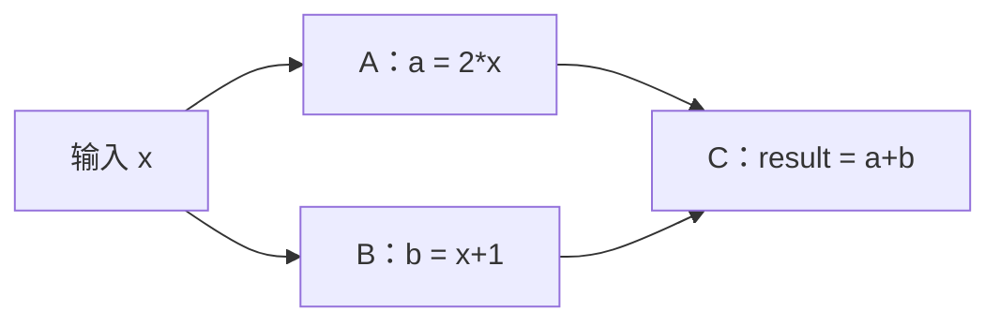

# 第二阶段：让 CUDA Graph 应对变化

从 05 开始按顺序学习。05–07 回答你在 02 中遇到的疑问；08–09 扩展到完整数据流程和分支依赖。每个文件约 80–100 行，独立编译，核心计算仍然只有四个数。

## 先建立一个判断顺序

| 发生了什么变化 | 本阶段采用的做法 | 示例 |
| --- | --- | --- |
| 地址相同，里面的输入数据变了 | 直接复用图 | 02、08 |
| 某个 kernel 的参数变了 | 更新该节点的参数 | 05 |
| 多个参数或 GPU 地址变了，流程结构相同 | 捕获新定义，尝试更新原来的可执行图 | 06 |
| 增加/删除节点，或改变依赖关系 | 用新定义重新实例化 | 07 |

这是学习这些例子时的选择方法，不是全部 API 限制的列表。“结构相同”只是整图更新的条件之一，代码仍必须检查更新是否成功。

## 05：更新一个 kernel 的参数

文件：[05_update_kernel_node.cu](05_update_kernel_node.cu)

**问题：** 图里原来做 `x += 1`，现在想做 `x += 10`，怎么改？

这里先换一种构图方法：**手动添加节点**。以前 capture 让 CUDA 自动记录节点；这次直接告诉 CUDA“图里加一个 kernel”，顺便拿到它的标识 `node`。两种方法最终都产生 `cudaGraph_t`。

把下面三样分开记：

| 对象 | 用途 |
| --- | --- |
| `graph` | 流程定义 |
| `node` | 定义中某个操作的标识，本例就是加法 kernel |
| `exec` | 真正拿来重放的可执行图 |

`cudaKernelNodeParams` 保存原来写在 launch 中的信息：

```text
add_value<<<grid, block>>>(d, n, delta)
             ↓      ↓      └─────┬───┘
          gridDim blockDim   kernelParams
函数 add_value 对应 func
```

代码中的 `void* args[] = {&d, &n, &delta}` 是**参数变量地址的列表**。CUDA 根据 kernel 的形参类型读取对应值。特别注意 `&d`：CUDA 要从这里读出 GPU 指针 `d` 的值。

添加节点时参数值会被复制，之后 `delta = 10` 不会自动改变已有图。真正更新执行参数的是：

```cpp
cudaGraphExecKernelNodeSetParams(exec, node, &params);
```

它直接修改 `exec` 中对应节点的参数。名称相近的 `cudaGraphKernelNodeSetParams` 修改的是图定义中的节点，不能靠它自动改变已经实例化的 `exec`。[API 说明](https://docs.nvidia.com/cuda/archive/12.6.0/cuda-runtime-api/group__CUDART__GRAPH.html)

```bash
mkdir -p build
nvcc -O2 -std=c++14 05_update_kernel_node.cu -o build/05_update_kernel_node
./build/05_update_kernel_node
```

预期输出：

```text
original (CPU delta=1): 2 3 4 5  PASS
CPU variable only (CPU delta=10): 2 3 4 5  PASS
exec updated (CPU delta=10): 11 12 13 14  PASS
```

每轮先恢复输入 `[1,2,3,4]`，所以你看到的变化仅来自参数更新。我们保留原 `graph` 和 `node`，直到不再需要更新为止。

**小练习：** 把第二轮的 `delta = 10.f` 改成 `5.f`。前两轮结果仍是 `2 3 4 5`，第三轮应变成 `6 7 8 9`。

## 06：重新捕获，然后更新整个可执行图

文件：[06_update_whole_graph.cu](06_update_whole_graph.cu)

**问题：** 两个 kernel 的参数都变了，而且要换一块 GPU 内存；不想逐个找节点，怎么办？

沿用熟悉的流程：`scale → bias`。第一轮是 `x * 2 + 1`，第二轮改为 `x * 3 + 10`，同时换一个 GPU 数据地址。

```text
第一次：捕获 graph0 → 实例化 exec → 重放
第二次：捕获 graph1 → 更新原 exec → 重放
```

关键调用：

```cpp
cudaGraphExecUpdateResultInfo info{};
cudaGraphExecUpdate(exec, new_graph, &info);
```

**重新捕获只是生成新的流程定义；更新则把新参数应用到旧的可执行图。** 这一轮没有再次调用 `cudaGraphInstantiate`，也不是先执行一遍新流程。捕获和更新本身仍有成本，只是省去了重新实例化这一步。

新术语 **topology（拓扑）** 就是“有哪些节点、节点之间怎样连接”。本例的两个图都是相同顺序的 `scale → bias`，仅数据地址与数值参数变化。更多图类型还有其他更新限制；保留原来的构建/捕获顺序，并检查返回结果。[官方更新说明](https://docs.nvidia.com/cuda/archive/12.6.0/cuda-c-programming-guide/index.html#updating-instantiated-graphs)

```bash
mkdir -p build
nvcc -O2 -std=c++14 06_update_whole_graph.cu -o build/06_update_whole_graph
./build/06_update_whole_graph
```

预期输出：

```text
round 1: instantiate
output: 3 5 7 9  PASS
round 2: update succeeded; new buffer, factor and offset
output: 13 16 19 22  PASS
```

两个 GPU 缓冲区都保留到执行完成后再释放。若更新失败，本例会报告并退出；下一节专门处理不能更新的情况。

**小练习：** 将第二组系数改成 `4`、偏置改成 `0`，第二轮应得到 `4 8 12 16`，更新仍应成功。

## 07：流程结构变了，就重新实例化

文件：[07_rebuild_graph.cu](07_rebuild_graph.cu)

**问题：** 原来有两个加法节点，现在多加一个，能否照搬 06 的更新？

```text
旧图：加 1 → 加 1
新图：加 1 → 加 1 → 加 1
```

节点数量变化，整图更新会拒绝。这不是 kernel 算错，而是更新方式不支持这个结构变化。

程序会区分三种情况：

1. 更新成功：继续使用原 `exec`。
2. 返回 `cudaErrorGraphExecUpdateFailure`：查看原因，本例应是 `cudaGraphExecUpdateErrorTopologyChanged`；使用新定义重新实例化，再替换旧 `exec`。
3. 其他 CUDA 错误：报告错误，不能一概当作“需要重建”。

这里 **重新构建可执行图** 指的是“新的流程定义 + 再次实例化”。代码先创建替代品，再销毁旧 `exec`；每轮执行结束都已同步，不会提前释放正在使用的资源。

```bash
mkdir -p build
nvcc -O2 -std=c++14 07_rebuild_graph.cu -o build/07_rebuild_graph
./build/07_rebuild_graph
```

预期输出：

```text
2 nodes: 2 2 2 2  PASS
update rejected: topology changed; instantiate a new exec
3 nodes: 3 3 3 3  PASS
```

`rejected` 是本节刻意演示的正常分支，之后的 `PASS` 证明替换后的图确实执行了三次加法。

**小练习：** 把 `steps` 的 `{2, 3}` 改成 `{2, 2}`。应该看到 `update succeeded`，第二轮不再重新实例化，结果仍为四个 `2`。

遇到变化时优先选择简单、正确的处理方式；更新是否比重建更划算，要在真实工作量下测量。这几个例子用于验证行为，不用于比较更新时间。

## 08：把数据复制也放入图

文件：[08_capture_memcpy.cu](08_capture_memcpy.cu)

**问题：** 02 每轮还得单独调用复制 API，能否一起录进去？

现在图里有四个节点：

```text
CPU 输入 → 复制到 GPU → scale → bias → 复制回 CPU 输出
```

新增两个概念：

- `cudaMemcpyAsync`：向指定流提交复制任务。`Async` 表示异步接口；读取输出前仍需等待完成。
- **pinned memory（页锁定内存）**：本例用 `cudaMallocHost` 分配的 CPU 内存，操作系统不会把它换出，适合进行异步 CPU/GPU 数据复制。[官方内存说明](https://docs.nvidia.com/cuda/archive/12.6.0/cuda-c-programming-guide/index.html#page-locked-host-memory)

分配内存发生在捕获前。捕获区域中的两次复制都用 `cudaMemcpyAsync(..., stream)`；本例不要换成同步版 `cudaMemcpy`。

每次重放前，只往同一个 `input` 缓冲区写入新数据。图记住复制的地址和大小，重放时读取当前内容。等整张图执行完成后，CPU 才能读取 `output` 或改写下一批 `input`。

```bash
mkdir -p build
nvcc -O2 -std=c++14 08_capture_memcpy.cu -o build/08_capture_memcpy
./build/08_capture_memcpy
```

预期输出：

```text
batch 1: 3 5 7 9  PASS
batch 2: 11 13 15 17  PASS
```

复制成为了图的一部分，但数据仍然实际传输；Graph 不会消除传输量。由于四步存在依赖，本例也没有让复制与计算同时进行。

**小练习：** 将输入生成式中的 `+ 1` 改成 `+ 10`，两批输出应为 `21 23 25 27`、`29 31 33 35`，无需更新图。

## 09：两条分支，等齐了再汇合

文件：[09_graph_dependencies.cu](09_graph_dependencies.cu)

**问题：** Graph 是否只能把一串 kernel 按顺序执行？

本例手动创建三个节点：



图中的 `X` 是数据来源，实际图节点只有 A、B、C。A、B 都读取 x，分别写不同数组，所以它们不需要互相等待；C 读取两个结果，必须等两者完成。

关键代码：

```cpp
cudaGraphNode_t dependencies[] = {a, b};
cudaGraphAddKernelNode(&c, graph, dependencies, 2, &params);
```

**手动构图时，添加节点的代码顺序不等于执行依赖。** 如果 C 漏写一个依赖，CUDA 不会根据 kernel 里的读写操作替你补上，即使偶然算对也不可靠。

没有 A→B 依赖表示允许它们并行，实际是否同时运行取决于硬件资源和调度。即使整张图只通过一条 stream 提交，内部仍按图的依赖关系执行。本例重点验证依赖和结果，不测量并发收益。

```bash
mkdir -p build
nvcc -O2 -std=c++14 09_graph_dependencies.cu -o build/09_graph_dependencies
./build/09_graph_dependencies
```

预期输出：

```text
A=2*x, B=x+1, C=A+B: 4 7 10 13  PASS
```

**小练习：** 在添加 B 的那一行，把 `nullptr, 0` 改成 `&a, 1`。此时增加 A→B 依赖，两个分支被强制按 A、B 的顺序执行；最终数值不变，仍应通过校验。

## 这一阶段的完成标准

- 能解释为什么“改 CPU 参数变量”“改图定义”“改可执行图”是不同的操作。
- 能选择直接复用、单节点更新、整图更新或重新实例化，并检查失败原因。
- 能把固定地址的输入输出复制放入图，并在合适的时机等待结果。
- 能根据数据依赖画出简单图，知道允许并行不等于一定并行。

这些示例为便于观察，每轮执行结束都先同步，再更新参数或重用缓冲区；这是一种简单安排，不代表所有更新 API 都要求先做全局同步。后续再学多 stream 的捕获、event（GPU 执行进度标记）和时间线分析。

## 验证记录

2026-09-26，CUDA Toolkit 12.6.85、NVIDIA GeForce RTX 4070 Ti SUPER、驱动 566.03。

05–09 均以 `-O2 -std=c++14 -Xcompiler -Wall,-Wextra` 编译，无警告；默认配置的实际输出与上述示例一致，全部校验通过，进程退出码为 0。07 已实际走过更新被拒绝后重新实例化的分支。

五节的小练习也已在临时副本中编译运行通过，包括 07 改为 `{2, 2}` 后更新成功、09 增加 A→B 依赖后数值不变。目录中的学习代码保留默认配置，方便你亲自修改练习。

更新 API 的准确限制可查阅 [CUDA 12.6 Graph Runtime API](https://docs.nvidia.com/cuda/archive/12.6.0/cuda-runtime-api/group__CUDART__GRAPH.html)。当前先掌握这些同设备、小数组、固定 kernel 的例子即可。
